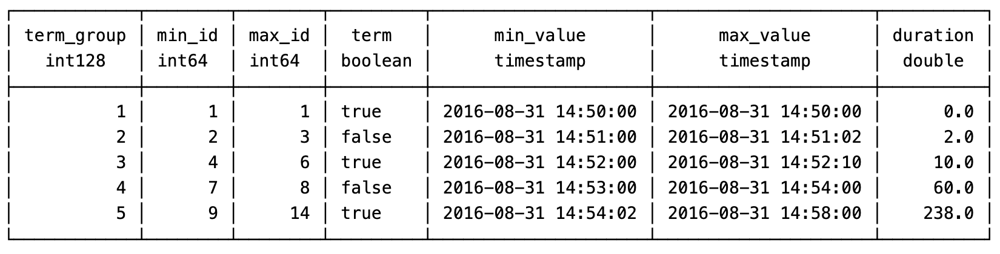

# DuckDB demo

## 1. PIVOT Case

will transform the following JSON into a PIVOT table:

to

## 2. Window Functions Case

* LAG OVER
* LEAD OVER
* SUM OVER
* RANK OVER

Testing Data in device_status.csv

